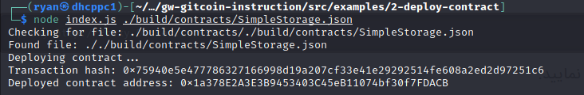

1) Deployed smart contract:


2) Transaction hash: 
```
0x75940e5e477786327166998d19a207cf33e41e29292514fe608a2ed2d97251c6
```
3) Deployed contract address: 
```
0x1a378E2A3E3B9453403C45eB11074bf30f7FDACB
```
